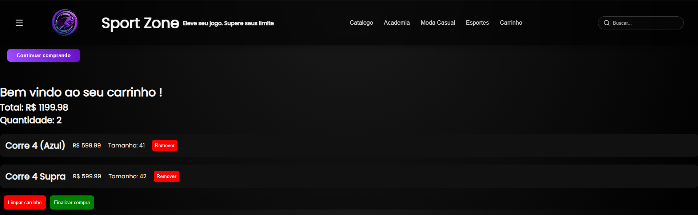
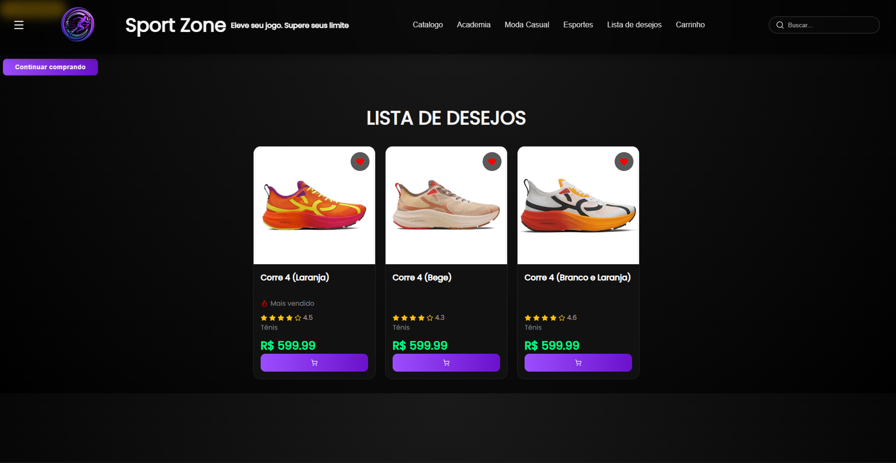

 Sport Zone

Um e-commerce de produtos esportivos desenvolvido com React.

 Sobre o projeto

O Sport Zone é uma aplicação web que simula uma loja online de produtos esportivos, permitindo ao usuário navegar pelos produtos, filtrar por marca e adicionar itens ao carrinho.

 Funcionalidades

* Busca de produtos
*  Filtro por marca
*  Carrinho de compras
*  Remover itens do carrinho
*  Finalizar compra
*  Persistência com LocalStorage
*  Interface moderna e responsiva

Tecnologias utilizadas

* React
* JavaScript
* CSS3
* React Router

Como rodar o projeto:

 1- Clone o repositório
    git clone https://github.com/castroo999/Sport-Zone.git

2- Acesse a pasta
   cd Sport-Zone/sport

3- Instale as dependências
   npm install

4- Rode o projeto
   git npm run dev

Preview

  

  

  

  

  

  

  

  

  

  

Status do projeto:
Completo

Autor:
Desenvolvido por Gustavo Castro 🚀
